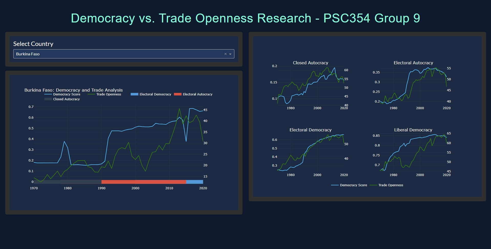
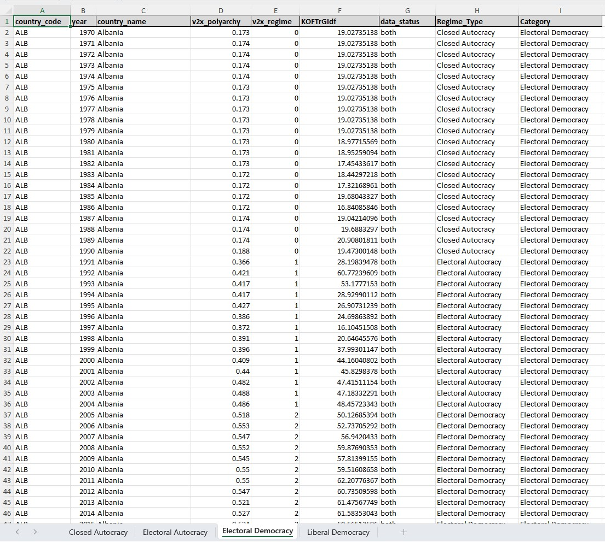

# Democracy vs Trade Openness Research Parser & Dashboard

Group Research Project for PSC354 at University at Buffalo. Contains Python Script for parsing V-Dem Democracy Scores and the KOF Globalization Index, visualizing the relationship between democracy scores and trade openness across different countries and regime categories from 1970–2020. Also contains a Dash web application that visualizes the data for sharing and presentation purposes. 

Website Link: https://insistent-vague-lanserver-sameerjain501.replit.app/

### Dashboard 


### Excel Page

## Features
 
- Individual country analysis with regime type indicators  
- Aggregate analysis by V-Dem Regime Category
- Dark Blue Theming  

## Project Structure

- `app.py` – Dash application  
- `psc_354_research_project_fileparser_vdem_and_kof.py` – Data processing script  
- `documented_code` – Commented versions of files  
- `democracy_trade_analysis.xlsx` – Parsed dataset  
- `assets/style.css` – More specific styling for web app  


## Installation

1. Requires Python 3.11+

2. Install dependencies:
   ```bash
   pip install dash dash-bootstrap-components flask matplotlib openpyxl pandas plotly xlsxwriter
   ```

## Running the App

1. Launch:
   ```bash
   python app.py
   ```

2. Visit:
   - Local: [http://0.0.0.0:8050](http://0.0.0.0:8050)

## Data Sources

- V-Dem Dataset – Democracy scores + regime types 

  - https://v-dem.net/data/the-v-dem-dataset/
  - https://v-dem.net/

- KOF Globalization Index Dataset – Trade openness values
  - https://kof.ethz.ch/prognosen-indikatoren/indikatoren/kof-globalisierungsindex.html
  - https://ethz.ch/de.html

## Visualizations

### Country-Specific:
- Democracy Score (blue line)  
- Trade Openness (green line)  
- Regime indicators  
- Missing data (light red)

### Regime Category:
- Aggregated trends  
- 2×2 grid layout for comparison

### Regime Type Legend   
  - Liberal Democracy → Green  
  - Electoral Democracy → Blue  
  - Electoral Autocracy → Red  
  - Closed Autocracy → Dark blue  

## Tech-Stack
- Dash (frontend)  
- Plotly (graphs)  
- Pandas (data)  
- Bootstrap (styling)

